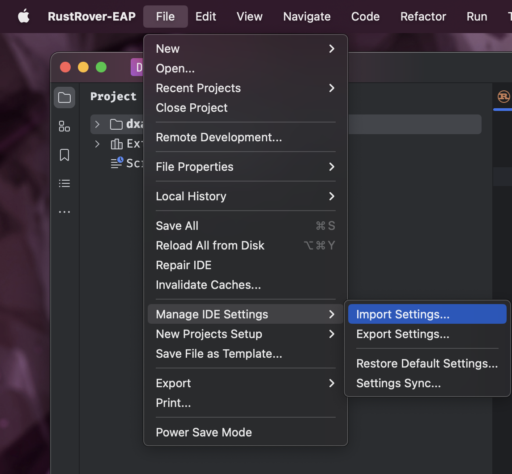
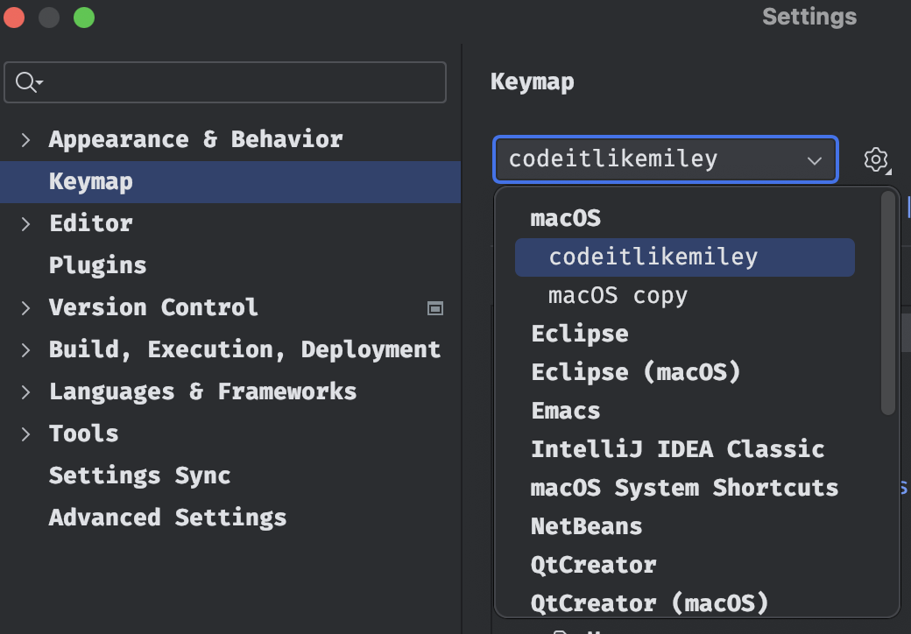
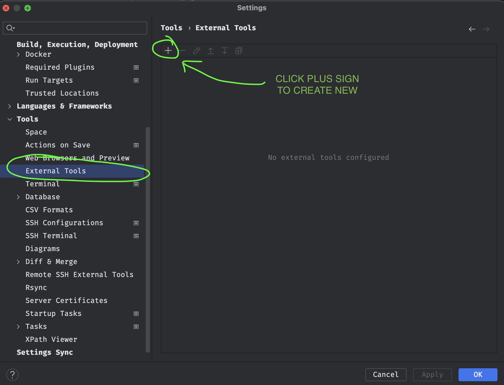
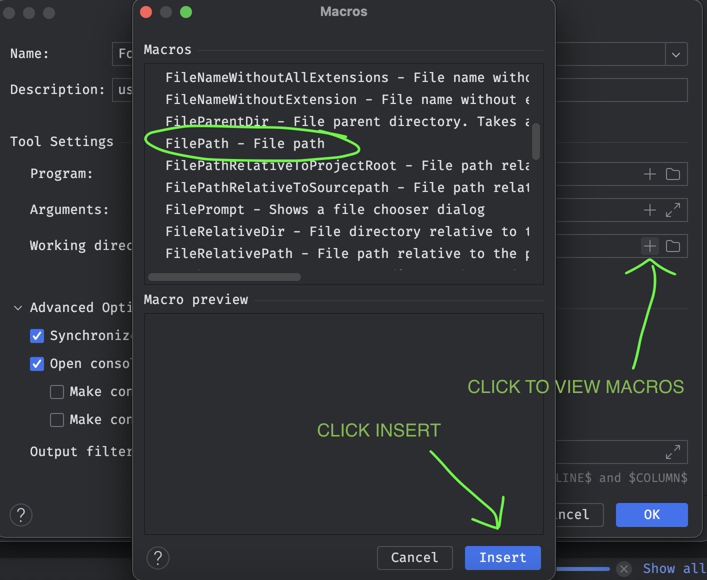
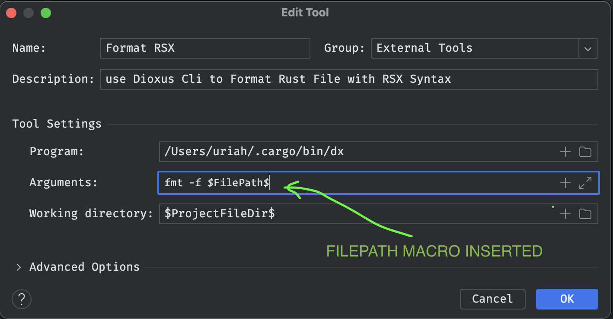
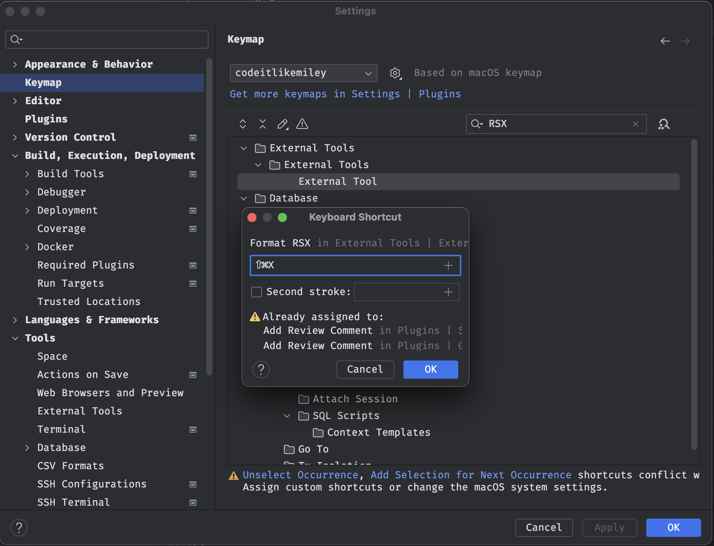

# Rust Rover IDE (MacOS Settings)

> Better workflow , testing and debugging capability on your Next Rust Projects

WARNING: This will make your Rust Journey EASY!

<details>
  <summary>
    <a href="https://github.com/codeitlikemiley/rust-rover-settings/raw/main/rust-rover-settings.zip">
      <strong>1. Download and Import rust-rover-settings.zip</strong>
    </a>
  </summary>
  
</details>

<details>
<summary>
2. Install  Plugins
</summary>

- IdeaVim
- IdeaVim-Sneak
- Whichkey
- .env file support
- Key Promoter X
- Github Copilot
- Ace Jump
- Linear
  
</details>


<details>
  <summary>3. Load `codeitlikemiley` keymap</summary>



</details>

#### 4. [Download ideavimrc](https://github.com/codeitlikemiley/rust-rover-settings/blob/main/.ideavimrc)

> Move the Downloaded file to your Home Directory `~/.ideavimrc`

#### 5. Learn The Keymap The Easy Way

<details>
<summary>
<strong>Toggle Tool Windows</strong>
</summary>
	
| Keyboard Shortcut                             | Description                          |
| --------------------------------------------- | ------------------------------------ |
| <kbd>CMD</kbd>+<kbd>J</kbd>                   | Hide Active Tool Window(Focus Editor)|
| <kbd>F12</kbd>                                | Hide All Tools Windows|

</details>

<details>
<summary>
<strong>Top Left Sidebar Tool Windows</strong>
</summary>

| Tool Window Keys (CMD+Fn Keys) Leftsidebar | Description       |
| ------------------------------------------ | ----------------- |
| <kbd>CMD</kbd>+<kbd>F1</kbd>               | Project           |
| <kbd>CMD</kbd>+<kbd>F2</kbd>               | Commit            |
| <kbd>CMD</kbd>+<kbd>F3</kbd>               | Bookmarks         |
| <kbd>CMD</kbd>+<kbd>F4</kbd>               | Pull Requests     |

</details>


<details>
<summary>
<strong>Top Right Sidebar Tool Windows</strong>
</summary>

| Tool Window Keys (CMD+Fn Keys) RightSidebar | Description                      |
| ------------------------------------------- | -------------------------------- |
| <kbd>CMD</kbd>+<kbd>F12</kbd>               | Notifications                    |
| <kbd>CMD</kbd>+<kbd>F11</kbd>               | Cargo                            |
| <kbd>CMD</kbd>+<kbd>F10</kbd>               | Key Promoter X (Plugin Required) |

</details>


<details>
<summary>
<strong>Bottom Left Sidebar Tool Windows</strong>
</summary>

| Tool Window Keys (OPT+Keys) Leftsidebar Bottom | Description |
| ---------------------------------------------- | ----------- |
| <kbd>OPT</kbd>+<kbd>G</kbd>                    | Git         |
| <kbd>OPT</kbd>+<kbd>B</kbd>                    | Build       |
| <kbd>OPT</kbd>+<kbd>S</kbd>                    | Services    |
| <kbd>OPT</kbd>+<kbd>P</kbd>                    | Problems    |
| <kbd>OPT</kbd>+<kbd>D</kbd>                    | Debug       |
| <kbd>OPT</kbd>+<kbd>F</kbd>                    | Find        |
| <kbd>OPT</kbd>+<kbd>R</kbd>                    | Run         |

</details>


<details>
<summary>
<strong>Fn Keys</strong>
</summary>
Mainly used for refactoring and documentation

| Keyboard Shortcuts | Description       |
| -------------- | --------------------- |
| <kbd>F1</kbd>  | Quick Documentation   |
| <kbd>F2</kbd>  | Rename                |
| <kbd>F3</kbd>  | Refactor this         |
| <kbd>F4</kbd>  | Change Signature      |
| <kbd>F5</kbd>  | Load Changes          |

</details>

<details>
<summary>
<strong>Rust Runnables</strong>
</summary>

| Keyboard Shorcuts                            | Description               |
| -------------------------------------------- | ------------------------- |
| <kbd>CMD</kbd>+<kbd>R</kbd>                  | Run Context Configuration |
| <kbd>CMD</kbd>+<kbd>SHIFT</kbd>+<kbd>R</kbd> | Run                       |
| <kbd>CMD</kbd>+<kbd>T</kbd>                  | External Tools            |


Note: External Tools Command Available depends on what you configure on my machine i have the ff:

- Format RSX
- HTML to RSX
- Dx Serve SSR
- Dx Serve Desktop

Et. al.

</details>


<details>
<summary>
<strong>Debugging</strong>
</summary>

| Keyboard Shorcuts                            | Description                 |
| -------------------------------------------- | --------------------------- |
| <kbd>CMD</kbd>+<kbd>B</kbd>                  | Toggle Breakpoint           |
| <kbd>CMD</kbd>+<kbd>SHIFT</kbd>+<kbd>S</kbd> | Stop                        |
| <kbd>OPT</kbd>+<kbd>L</kbd>                  | Step Into                   |
| <kbd>OPT</kbd>+<kbd>J</kbd>                  | Step Over                   |
| <kbd>OPT</kbd>+<kbd>K</kbd>                  | Pause / Resume Program      |
| <kbd>OPT</kbd>+<kbd>H</kbd>                  | Step Out                    |


</details>

<details>
<summary>
<strong>Errors / Warning</strong>
</summary>

| Keyboard Shortcut                             | Description                        |
| --------------------------------------------- | ---------------------------------- |
| <kbd>OPT</kbd>+<kbd>P</kbd>                   | Problems                           |
| <kbd>OPT</kbd>+<kbd>SHIFT</kbd>+<kbd>I</kbd>  | Inspect Code with Editor Settings  |
| <kbd>]</kbd>+<kbd>E</kbd> (VIM)               | Next Error                         |
| <kbd>[</kbd>+<kbd>E</kbd> (VIM)               | Previous Error                     |


</details>


<details>
<summary>
<strong>Code Completions</strong>
</summary>

| Keyboard Shortcut                             | Description                     |
| --------------------------------------------- | ------------------------------- |
| <kbd>OPT</kbd>+<kbd>/</kbd>                   | Cyclic Expand Word              |
| <kbd>OPT</kbd>+<kbd>SHIFT</kbd>+<kbd>/</kbd>  | Cyclic Expand Backward          |
| <kbd>OPT</kbd>+<kbd>Space</kbd>               | Basic                           |
| <kbd>OPT</kbd>+<kbd>ENTER</kbd>               | Type Matching                   |


</details>

<details>
<summary>
<strong>Code Generations / Snippets / Quick Fixes </strong>
</summary>

| Keyboard Shortcut                             | Description                          |
| --------------------------------------------- | ------------------------------------ |
| <kbd>CMD</kbd>+<kbd>J</kbd>                   | Insert Live Template                 |
| <kbd>CMD</kbd>+<kbd>K</kbd>                   | Generate                             |
| <kbd>CMD</kbd>+<kbd>L</kbd>                   | Complete Current Statement           |
| <kbd>OPT</kbd>+<kbd>W</kbd>                   | Surround with Live Template          |
| <kbd>CMD</kbd>+<kbd>.</kbd>                   | Show Context and Show Quick Fixes    |

</details>

<details>
<summary>
<strong>Quickly Jump from One Place to Another</strong>
</summary>

| Keyboard Shortcut                                             | Description                    |
| ------------------------------------------------------------- | ------------------------------ |
| <kbd>S</kbd> (Vim)                                            | Activate / Cycle AceJump Mode  |
| <kbd>leader</kbd>+<kbd>leader</kbd>+<kbd>w</kbd>              | Search Word Forward            |
| <kbd>leader</kbd>+<kbd>leader</kbd>+<kbd>b</kbd>              | Search Word Backward           |
| <kbd>leader</kbd>+<kbd>leader</kbd>+<kbd>f</kbd>              | Search Char Forward            |
| <kbd>leader</kbd>+<kbd>leader</kbd>+<kbd>F</kbd>              | Search Char Backward           |

</details>


<details>
<summary>
<strong>Multi-Cursor</strong>
</summary>

| Keyboard Shortcut                             | Description                                  |
| --------------------------------------------- | -------------------------------------------- |
| <kbd>CMD</kbd>+<kbd>G</kbd>                   | Find Next / Move to Next Occurrence          |
| <kbd>CMD</kbd>+<kbd>SHIFT</kbd>+<kbd>G</kbd>  | Find Previous / Move to Previous Occurrence  |
| <kbd>CMD</kbd>+<kbd>D</kbd>                   | Add Selection for Next Occurrence            |
| <kbd>CMD</kbd>+<kbd>SHIFT</kbd>+<kbd>D</kbd>  | Unselect Occurrence                          |
| <kbd>CMD</kbd>+<kbd>SHIFT</kbd>+<kbd>L</kbd>  | Select All Occurrence                        |

</details>


<details>
<summary>
<strong>GoTo</strong>
</summary>

| Keyboard Shortcut                                       | Description                    |
| ------------------------------------------------------- | ------------------------------ |
| <kbd>gd</kbd> (Vim)                                     | Go to Declaration or Usages    |
| <kbd>gD</kbd> (Vim)                                     | Go to TypeDeclaration          |
| <kbd>gu</kbd> (Vim)                                     | Find Usages                    |
| <kbd>gi</kbd> (Vim)                                     | Go to Implementations          |
| <kbd>CMD</kbd>+<kbd>U</kbd>                             | Go to Super Method             |
| <kbd>SHIFT</kbd>+<kbd>K</kbd> (Vim)                     | Quick Definition               |
| <kbd>F1</kbd>                                           | Quick Documentation            |

</details>


<details>
<summary>
<strong>Finders</strong>
</summary>

| Keyboard Shortcut                           | Description       |
| ------------------------------------------- | ----------------- |
| <kbd>CMD</kbd>+<kbd>F</kbd>                 | Find              |
| <kbd>CMD</kbd>+<kbd>E</kbd>                 | Recent Files      |
| <kbd>CMD</kbd>+<kbd>SHIFT</kbd>+<kbd>F</kbd>| Find in Files     |
| <kbd>CMD</kbd>+<kbd>H</kbd>                 | Replace           |
| <kbd>CMD</kbd>+<kbd>SHIFT</kbd>+<kbd>H</kbd>| Replace in Files  |
| <kbd>SHIFT</kbd>+<kbd>SHIFT</kbd>           | Search Everywhere |
| <kbd>CMD</kbd>+<kbd>P</kbd>                 | Go To File        |
| <kbd>CMD</kbd>+<kbd>SHIFT</kbd>+<kbd>P</kbd>| Run any Command   |
| <kbd>CMD</kbd>+<kbd>O</kbd>                 | Go to Symbol      |
| <kbd>CMD</kbd>+<kbd>SHIFT</kbd>+<kbd>O</kbd>| Go To Types       |
| <kbd>SHIFT</kbd>+<kbd>SPACE</kbd>           | Go to Action      |
| <kbd>CMD</kbd>+<kbd>SHIFT</kbd>+<kbd>T</kbd>| Go to Test        |

</details>


<details>
<summary>
<strong>Bookmarks</strong>
</summary>

| Keyboard Shortcut                            | Description                    |
| -------------------------------------------- | ------------------------------ |
| <kbd>leader</kbd>+<kbd>[0-9]</kbd>           | Go to Bookmark by number       |
| <kbd>leader</kbd>+<kbd>[a-z]</kbd>           | Go to Bookmark by letters      |
| <kbd>'</kbd>+<kbd>[a-z]</kbd>                | Toggle Bookmark by letters     |
| <kbd>'</kbd>+<kbd>[0-9]</kbd>                | Toggle Bookmark by number      |

</details>


<details>
<summary>
<strong>Code Selections</strong>
</summary>

| Keyboard Shortcut                            | Description                |
| -------------------------------------------- | -------------------------- |
| <kbd>OPT</kbd>+<kbd>DOWN</kbd>               | Shrink Selection           |
| <kbd>OPT</kbd>+<kbd>UP</kbd>                 | Expand Selection           |

</details>

<details>
<summary>
<strong>Move Statements</strong>
</summary>

| Keyboard Shortcut                            | Description                |
| -------------------------------------------- | -------------------------- |
| <kbd>OPT</kbd>+<kbd>SHIFT</kbd>+<kbd>J</kbd> | Move Statement Down        |
| <kbd>OPT</kbd>+<kbd>SHIFT</kbd>+<kbd>K</kbd> | Move Statement Up          |

</details>


<details>
<summary>
<strong>Move Lines</strong>
</summary>

| Keyboard Shortcut                            | Description         |
| -------------------------------------------- | ------------------- |
| <kbd>CMD</kbd>+<kbd>SHIFT</kbd>+<kbd>J</kbd> | Move Line Down      |
| <kbd>CMD</kbd>+<kbd>SHIFT</kbd>+<kbd>K</kbd> | Move Line Up        |

</details>

<details>
<summary>
<strong>Split Panes</strong>
</summary>

| Keyboard Shortcut                        | Description        |
| ---------------------------------------- | ------------------ |
| <kbd>s</kbd>+<kbd>p</kbd>                | Horizontal Split   |
| <kbd>v</kbd>+<kbd>s</kbd>++<kbd>p</kbd>  | Vertical Split     |

</details>


<details>
<summary>
<strong>Moving Across Panes</strong>
</summary>

| Keyboard Shortcut                        | Description        |
| ---------------------------------------- | ------------------ |
| <kbd>CTRL</kbd>+<kbd>H</kbd>             | Move to Left Pane  |
| <kbd>CTRL</kbd>+<kbd>J</kbd>             | Move Down Pane     |
| <kbd>CTRL</kbd>+<kbd>K</kbd>             | Move to Right Pane |
| <kbd>CTRL</kbd>+<kbd>L</kbd>             | Move Up Pane       |

</details>


<details>
<summary>
<strong>Tab Switching</strong>
</summary>

| Keyboard Shortcut                | Description          |
| -------------------------------- | ---------------------|
| <kbd>CMD</kbd>+<kbd>[1-9]</kbd>  | Select Tab [1-9]     |
| <kbd>CMD</kbd>+<kbd>[</kbd>      | Select Previous Tab  |
| <kbd>CMD</kbd>+<kbd>]</kbd>      | Select Next Tab      |
| <kbd>TAB</kbd>+<kbd>[</kbd>      | Navigate Tab Back    |
| <kbd>TAB</kbd>+<kbd>]</kbd>      | Navigate Tab Forward |

</details>

<details>
<summary>
<strong>Comments</strong>
</summary>

| Keyboard Shortcut                              | Description                |
| ---------------------------------------------- | -------------------------- |
| <kbd>CMD</kbd>+<kbd>/</kbd>                    | Comment with Line Comment  |
| <kbd>CMD</kbd>+<kbd>SHIFT</kbd>+<kbd>/</kbd>   | Comment with Block Comment |

</details>

<details>
<summary>
<strong>Code Folding</strong>
</summary>

| Keyboard Shortcut                              | Description                |
| ---------------------------------------------- | -------------------------- |
| <kbd>CMD</kbd>+<kbd>(-)</kbd>                  | Folding Collapse           |
| <kbd>CMD</kbd>+<kbd>(+)</kbd>                  | Folding Expand             |
| <kbd>CMD</kbd>+<kbd>SHIFT</kbd>+<kbd>(-)</kbd> | Collapse All               |
| <kbd>CMD</kbd>+<kbd>SHIFT</kbd>+<kbd>(+)</kbd> | Expand All                 |

</details>


<details>
<summary>
<strong>File Manipulation</strong>
</summary>

| Shortcut Keys                                  | Description       |
| ---------------------------------------------- | ----------------- |
| <kbd>CMD</kbd>+<kbd>N</kbd>                    | New               |
| <kbd>CMD</kbd>+<kbd>SHIFT</kbd>+<kbd>N</kbd>   | New Directory     |

</details>

Note: New has Different ways to create Files including Directory

<details>
<summary>
<strong>File Editing</strong>
</summary>

| Shortcut Keys                                 | Description |
| --------------------------------------------- | ----------- |
| <kbd>CMD</kbd>+<kbd>S</kbd>                   | Save all    |
| <kbd>CMD</kbd>+<kbd>X</kbd>                   | Cut         |
| <kbd>CMD</kbd>+<kbd>V</kbd>                   | Paste       |
| <kbd>CMD</kbd>+<kbd>Z</kbd>                   | Undo        |
| <kbd>CMD</kbd>+<kbd>SHIFT</kbd>+<kbd>Z</kbd>  | Redo        |

</details>


<details>
<summary>
<strong>Notifications</strong>
</summary>

| Keyboard Shortcut                             | Description                  |
| --------------------------------------------- | ---------------------------- |
| <kbd>CMD</kbd>+<kbd>F12</kbd>                 | Tool Windows -> Notification |
| <kbd>CMD</kbd>+<kbd>SHIFT</kbd>+<kbd>F12</kbd>| Clear all Notifications      |
| <kbd>OPT</kbd>+<kbd>SHIFT</kbd>+<kbd>M</kbd>  | Maximize Tool Window         |

</details>


<details>
<summary>
<strong>Context Menus</strong>
</summary>

| Keyboard Shortcut                             | Description          |
| --------------------------------------------- | -------------------- |
| <kbd>OPT</kbd>+<kbd>SHIFT</kbd>+<kbd>C</kbd>  | Show Color Picker    |
| <kbd>SHIFT</kbd>+<kbd>F1</kbd>                | Show Context Menu    |

</details>


<details>
<summary>
<strong>VCS</strong>
</summary>

| Keyboard Shortcut                             | Description               |
| --------------------------------------------- | ------------------------- |
| <kbd>OPT</kbd>+<kbd>A</kbd>                   | Amend                     |
| <kbd>OPT</kbd>+<kbd>C</kbd>                   | Commit File               |
| <kbd>OPT</kbd>+<kbd>SHIFT</kbd>+<kbd>A</kbd>  | Add to .gitignore         |
| <kbd>CMD</kbd>+<kbd>SHIFT</kbd>+<kbd>A</kbd>  | Add to VCS                |
| <kbd>CMD</kbd>+<kbd>SHIFT</kbd>+<kbd>U</kbd>  | Rollback                  |
| <kbd>CMD</kbd>+<kbd>SHIFT</kbd>+<kbd>M</kbd>  | Move to other Changelist  |

</details>

<details>
<summary>
<strong>Git History</strong>
</summary>

| Keyboard Shortcut                             | Description               |
| --------------------------------------------- | ------------------------- |
| <kbd>OPT</kbd>+<kbd>SHIFT</kbd>+<kbd>R</kbd>  | Compare with Revisions    |
| <kbd>CMD</kbd>+<kbd>SHIFT</kbd>+<kbd>Y</kbd>  | Show History / Diff       |
| <kbd>CMD</kbd>+<kbd>J</kbd>                   | Next Difference           |
| <kbd>CMD</kbd>+<kbd>K</kbd>                   | Previous Difference       |

</details>


## Customizing IdeaVim Keys

1. Enable Idea Vim on Actions List

```sh
:actionlist
```

2. Open Action List

<kbd>SHIFT</kbd>+<kbd>SPACE</kbd>


3. Set `ON` 

```sh
IdeaVim: Track Action IDs
```

All the Keys and Commands You Invoke Now will be shown as a Notification

4. Open `~/.ideavimrc`


5. Add Custom Vim Key Bindings
6. 
```sh
nmap <leader>v :action Tool_External Tools_gvim<cr>
```

## Custom Keymap to Invoke External CLI Commands

This is useful e.g. , We wanna add <kbd>CMD</kbd>+<kbd>SHIFT</kbd>+<kbd>X</kbd> to format RSX in rust with Dioxus CLI

<details>
<summary>See How To do It</summary>

Open settings with CMD + ,

Go to Tools -> External Tools

Then Click (+) Sign to Create new External Tool



To Get the Path of Command Use which e.g.

which dx , outputs: /Users/uriah/.cargo/bin/dx

also we need to check what arguments we can use

we can run `dx --help`

```sh
dx --help
Build, Bundle & Ship Dioxus Apps

Usage: dx [OPTIONS] <COMMAND>

Commands:
  build      Build the Rust WASM app and all of its assets
  translate  Translate some source file into Dioxus code
  serve      Build, watch & serve the Rust WASM app and all of its assets
  create     Init a new project for Dioxus
  clean      Clean output artifacts
  bundle     Bundle the Rust desktop app and all of its assets
  version    Print the version of this extension
  fmt        Format some rsx
  check      Check the Rust files in the project for issues
  config     Dioxus config file controls
  help       Print this message or the help of the given subcommand(s)

Options:
  -v               Enable verbose logging
      --bin <BIN>  Specify bin target
  -h, --help       Print help
  -V, --version    Print version
```

Get `dx fmt` argurments

```sh
dx fmt --help
Format some rsx

Usage: dx fmt [OPTIONS]

Options:
  -c, --check        Run in 'check' mode. Exits with 0 if input is formatted correctly. Exits with 1 and prints a diff if formatting is required
  -r, --raw <RAW>    Input rsx (selection)
  -f, --file <FILE>  Input file
      --bin <BIN>    Specify bin target
  -h, --help         Print help
```

in order to format a file we need to use -f parameter

to get the filepath we can get it with Insert Macro

Just Click the Plus sign as shown on the image below.



We got `$FilePath$`



Click Insert then Go Bind the KeyMap



</details>

## Setting  Up Linear

<details>
<summary>
<strong>Step by Step Guide</strong>
</summary>

1. Go to Settings -> Tools -> Tasks -> Server 
2. Add Server 
3. Pick Linear
4. Set:
	- Team ID e.g (COD)
	- API Key (Workspace API)
	- Workspace ID (codeitlikemiley)
5. Click Test

| Linear Keys                                   | Description    |
| --------------------------------------------- | -------------- |
| <kbd>CMD</kbd>+<kbd>\\</kbd>                  | Open Tasks     |
| <kbd>CMD</kbd>+<kbd>SHIFT</kbd>+<kbd>\\</kbd> | Switch Tasks   |

</details>


