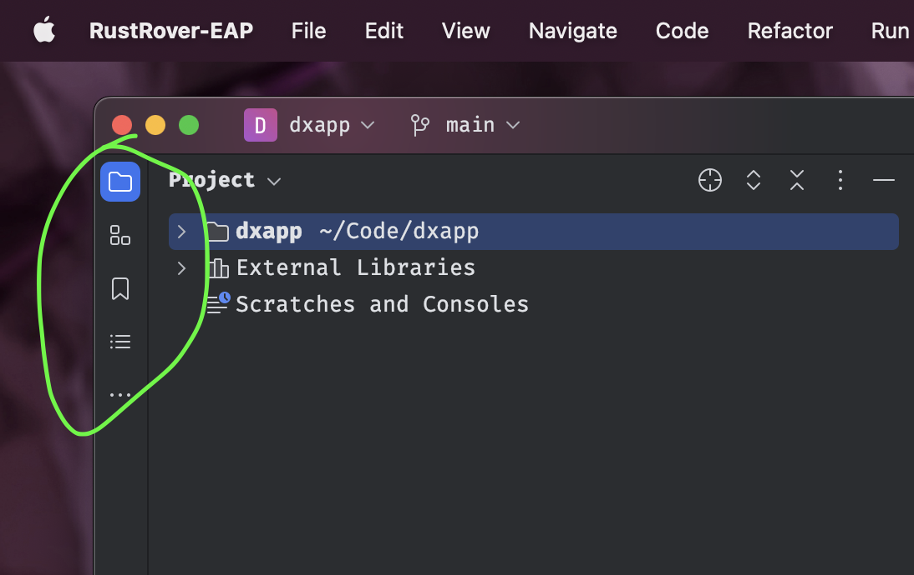

# Rust Rover IDE (MacOS Settings)

> Better workflow , testing and debugging capability on your Next Rust Projects


<details>
<summary>
<strong>1. Import rust-rover-settings.zip<strong>
</summary>

[Download Settings](https://github.com/codeitlikemiley/rust-rover-settings/raw/main/rust-rover-settings.zip)


</details>

<details>
<summary>
2. Install  Plugins
</summary>

- IdeaVim
- IdeaVim-Sneak
- Whichkey
- .env file support
- Better highlights
- Github Copilot

</details>


<details>
  <summary>3. Load `codeitlikemiley` keymap</summary>


</details>

### 4. [Download Move ideavimrc](https://github.com/codeitlikemiley/rust-rover-settings/blob/main/.ideavimrc)

> Move the Downloaded file to your Home Directory `~/.ideavimrc`

## 5. Learn The Keymap The Easy Way

<details>
  <summary>Keybindings for Tool Windows</summary>

### <strong>Upper Left SideBar Keybindings</strong>



<kbd>CMD</kbd> + <kbd>F1</kbd> === `Tool Windows: Project`

<kbd>CMD</kbd> + <kbd>F2</kbd> === `Tool Windows: Structure`

<kbd>CMD</kbd> + <kbd>F3</kbd> === `Tool Windows: Bookmarks`

<kbd>CMD</kbd> + <kbd>F4</kbd> === `Tool Windows: TODO`

<kbd>CMD</kbd> + <kbd>F5</kbd> === `Refresh Cargo Projects`


### <strong>Right SideBar Keybindings</strong>


<kbd>CMD</kbd> + <kbd>F12</kbd> === `Tool Windows: Notifications`

<kbd>CMD</kbd> + <kbd>F11</kbd> === `Tool Windows: Cargo`

<kbd>CMD</kbd> + <kbd>F10</kbd> === `Tool Windows: Database`

<kbd>CMD</kbd> + <kbd>F9</kbd> === `Tool Windows: Github Co-pilot`


### <strong>Lower Left SideBar Keybindings</strong>


<kbd>OPT</kbd> + <kbd>C</kbd> === `Tool Windows: Commit`

<kbd>OPT</kbd> + <kbd>G</kbd>=== `Tool Windows: Git`

<kbd>OPT</kbd> + <kbd>B</kbd> === `Tool Windows: Build`

<kbd>OPT</kbd> + <kbd>R</kbd> === `Tool Windows: Run`

<kbd>OPT</kbd> + <kbd>X</kbd> === `Tool Windows: Problems`

<kbd>CMD</kbd> + <kbd>TILDA</kbd> === `Tool Windows: Terminal`

</details>

<details>
<summary>
<strong>Keybindings for FN Keys<strong>
</summary>

<kbd>F1</kbd> === `Quick Documentation`

<kbd>F2</kbd> === `Rename`

<kbd>F3</kbd> === `Refactor`

<kbd>F4</kbd> === `Jump To Source`

</details>


<details>
<summary>
<strong>Rust Runnables<strong>
</summary>

<kbd>CMD</kbd> + <kbd>R</kbd>=== `Run Under Cursor`

<kbd>CMD</kbd> + <kbd>SHIFT</kbd> + <kbd>R</kbd>=== `Re-Run Last Command`

</details>

<details>
<summary>
<strong>Rust Debug<strong>
</summary>

<kbd>CMD</kbd> + <kbd>T</kbd>=== `Run Debugger Under Cursor`

<kbd>CMD</kbd> + <kbd>SHIFT</kbd> + <kbd>D</kbd>=== `Toggle Debugger Breakpoint`

<kbd>CMD</kbd> + <kbd>SHIFT</kbd> + <kbd>T</kbd>=== `Stop`

</details>

<details>
<summary>
<strong>Find<strong>
</summary>

<kbd>CMD</kbd> + <kbd>F</kbd>=== `Find`

<kbd>CMD</kbd> + <kbd>N</kbd>=== `Find Next`

<kbd>CMD</kbd> + <kbd>SHIFT</kbd> + <kbd>N</kbd>=== `Find Previous`

<kbd>CMD</kbd> + <kbd>SHIFT</kbd> + <kbd>F</kbd>=== `Find in Files`

</details>

<details>
<summary>
<strong>Go To<strong>
</summary>

<kbd>CMD</kbd> + <kbd>P</kbd>=== `Search Everywhere`

<kbd>CMD</kbd> + <kbd>O</kbd>=== `Go to Type`

<kbd>CMD</kbd> + <kbd>I</kbd>=== `Go to Implementations`

<kbd>CMD</kbd> + <kbd>U</kbd>=== `Find Usage`

<kbd>CMD</kbd> + <kbd>E</kbd>=== `Find Recent`

<kbd>CMD</kbd> + <kbd>D</kbd>=== `Quick Definition`

<kbd>CMD</kbd> + <kbd>G</kbd>=== `Go to Line:Column`


</details>


<details>
<summary>
<strong>Search and Replace<strong>
</summary>

<kbd>OPT</kbd> + <kbd>S</kbd>=== `Replace`

<kbd>OPT</kbd> + <kbd>SHIFT</kbd> + <kbd>S</kbd>=== `Replace in Files`

</details>

<details>
<summary>
<strong>Bookmarks/Mnemonics<strong>
</summary>

<kbd>CMD</kbd> + <kbd>M</kbd>=== `Go to Mnemonic`

<kbd>CMD</kbd> + <kbd>SHIFT</kbd> + <kbd>M</kbd>===  `Toggle Bookmark Mnemonic`

<kbd>CMD</kbd> + <kbd>B</kbd>=== `Show Bookmarks`

<kbd>CMD</kbd> + <kbd>SHIFT</kbd> + <kbd>B</kbd>=== `Toggle Bookmark/Mnemonic`


<strong> GO TO Bookmark Number</strong>


<kbd>CTRL</kbd> + <kbd>1</kbd>=== `Go to Bookmark 1`

<kbd>CTRL</kbd> + <kbd>2</kbd>=== `Go to Bookmark 2`

<kbd>CTRL</kbd> + <kbd>3</kbd>=== `Go to Bookmark 3`

<kbd>CTRL</kbd> + <kbd>4</kbd>=== `Go to Bookmark 4`

<kbd>CTRL</kbd> + <kbd>5</kbd>=== `Go to Bookmark 5`

<kbd>CTRL</kbd> + <kbd>6</kbd>=== `Go to Bookmark 6`

<kbd>CTRL</kbd> + <kbd>7</kbd>=== `Go to Bookmark 7`

<kbd>CTRL</kbd> + <kbd>8</kbd>=== `Go to Bookmark 8`

<kbd>CTRL</kbd> + <kbd>9</kbd>=== `Go to Bookmark 9`

<kbd>CTRL</kbd> + <kbd>0</kbd>=== `Go to Bookmark 0`

</details>


<details>
<summary>
<strong>OPT+ HJKL<strong>
</summary>

<kbd>OPT</kbd> + <kbd>H</kbd>=== `Shrink Selectiont`

<kbd>OPT</kbd> + <kbd>J</kbd>=== `Move Line Down`

<kbd>OPT</kbd> + <kbd>K</kbd>=== `Move Line Up`

<kbd>OPT</kbd> + <kbd>L</kbd>=== `Expand Selection`

</details>


<details>
<summary>
<strong>CTRL+ HJKL<strong>
</summary>

<strong>Mainly Use on for Navigating between Vim Splits</strong>

<kbd>CTRL</kbd> + <kbd>H</kbd>=== `Move Left Pane`

<kbd>CTRL</kbd> + <kbd>J</kbd>=== `Move Down Pane`

<kbd>CTRL</kbd> + <kbd>K</kbd>=== `Move Up Pane`

<kbd>CTRL</kbd> + <kbd>L</kbd>=== `Move Right Pane`

</details>

<details>
<summary>
<strong>Easy Tab Switching with CMD [1-9]<strong>
</summary>

<kbd>CMD</kbd> + <kbd>1</kbd>=== `Select Tab 1`

<kbd>CMD</kbd> + <kbd>2</kbd>=== `Select Tab 2`

<kbd>CMD</kbd> + <kbd>3</kbd>=== `Select Tab 3`

<kbd>CMD</kbd> + <kbd>4</kbd>=== `Select Tab 4`

<kbd>CMD</kbd> + <kbd>5</kbd>=== `Select Tab 5`

<kbd>CMD</kbd> + <kbd>6</kbd>=== `Select Tab 6`

<kbd>CMD</kbd> + <kbd>7</kbd>=== `Select Tab 7`

<kbd>CMD</kbd> + <kbd>8</kbd>=== `Select Tab 8`

<kbd>CMD</kbd> + <kbd>9</kbd>=== `Select Tab 9`

</details>

<details>
<summary>
<strong>Comments<strong>
</summary>


<kbd>CMD</kbd>+<kbd>/</kbd> === `Comment`

<kbd>CMD</kbd>+<kbd>SHIFT</kbd> +<kbd>/</kbd>=== `Comment`

</details>


<details>
<summary>
<strong>Quick Fixes / Warnings<strong>
</summary>

<kbd>CMD</kbd>+<kbd>.</kbd> === `Quick Fixes`

<kbd>CMD</kbd>+<kbd>[</kbd> === `Previous Highlighted Error`

<kbd>CMD</kbd>+<kbd>]</kbd> === `Next Highlighted Error`

<kbd>CMD</kbd>+<kbd>Backslash(\)</kbd> === `Clear All Notificactions`

</details>


<details>
<summary>
<strong>Snippets<strong>
</summary>

<kbd>OPT</kbd>+<kbd>SPACE</kbd> === `Insert Live Templates`

<kbd>OPT</kbd>+<kbd>T</kbd> === `Save Highlighted Text to Live Template`

</details>

<details>
<summary>
<strong>Copy / Paste / Save / Undo / Redo<strong>
</summary>

<kbd>CMD</kbd>+<kbd>S</kbd> === `Save all`

<kbd>CMD</kbd>+<kbd>X</kbd> === `Cut`

<kbd>CMD</kbd>+<kbd>V</kbd> === `Paste`

<kbd>CMD</kbd>+<kbd>Z</kbd> === `Undo`

<kbd>CMD</kbd>+<kbd>SHIFT</kbd>>+<kbd>Z</kbd> === `Redo`

<kbd>CMD</kbd>+<kbd>Y</kbd> === `Undo`

</details>


## Customizing IdeaVim Keys

check list of Actions we can bind with .IdeaVim to our Keys

```sh
:actionlist
```

We can add e.g. to our `~/.ideavimrc`

```sh
nmap <leader>v :action Tool_External Tools_gvim<cr>
```


